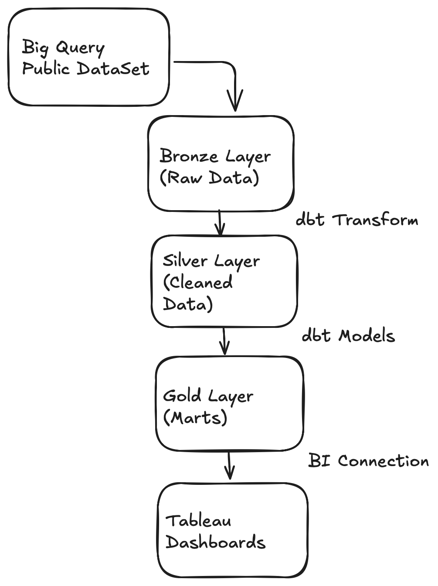
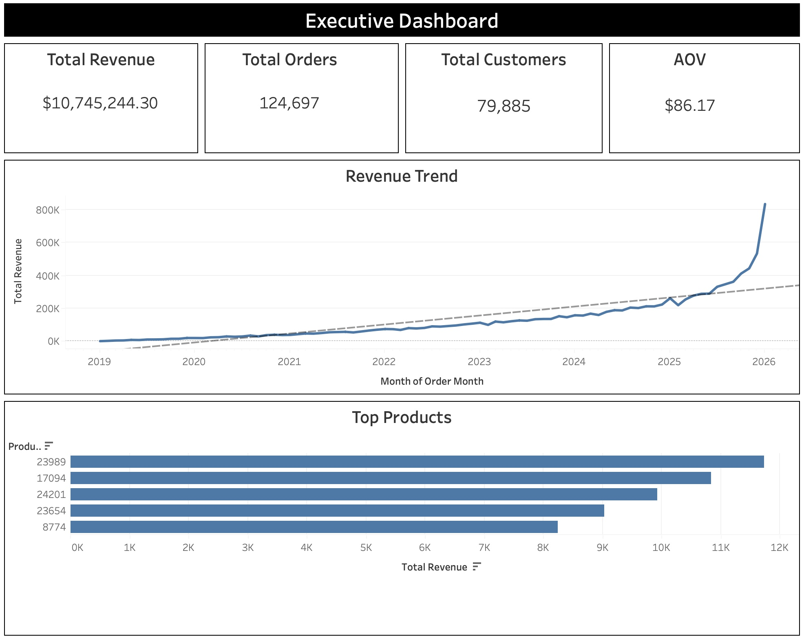
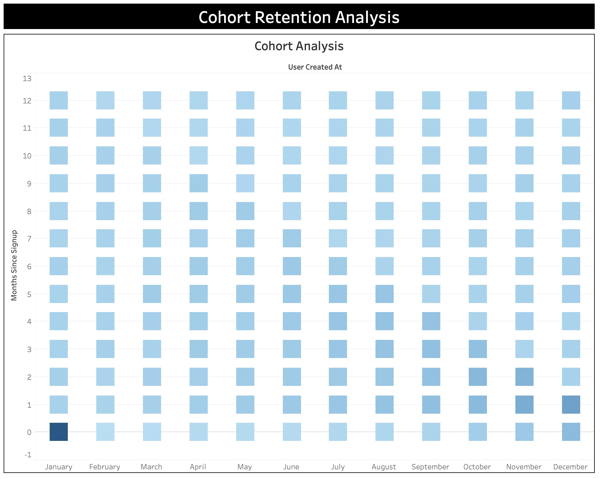
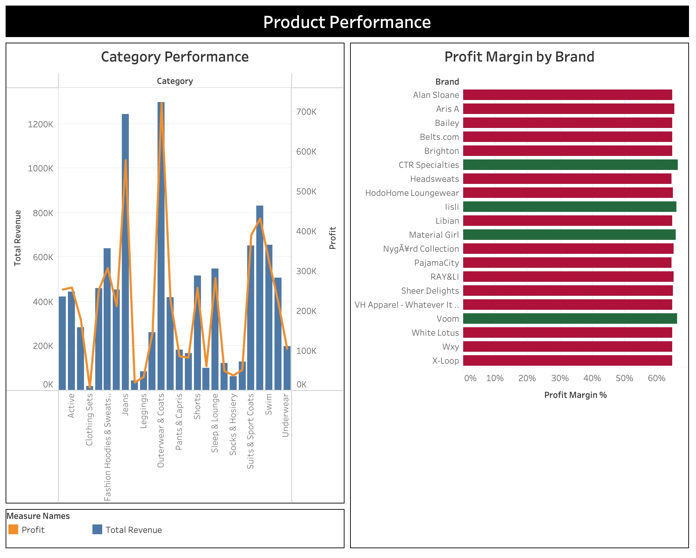
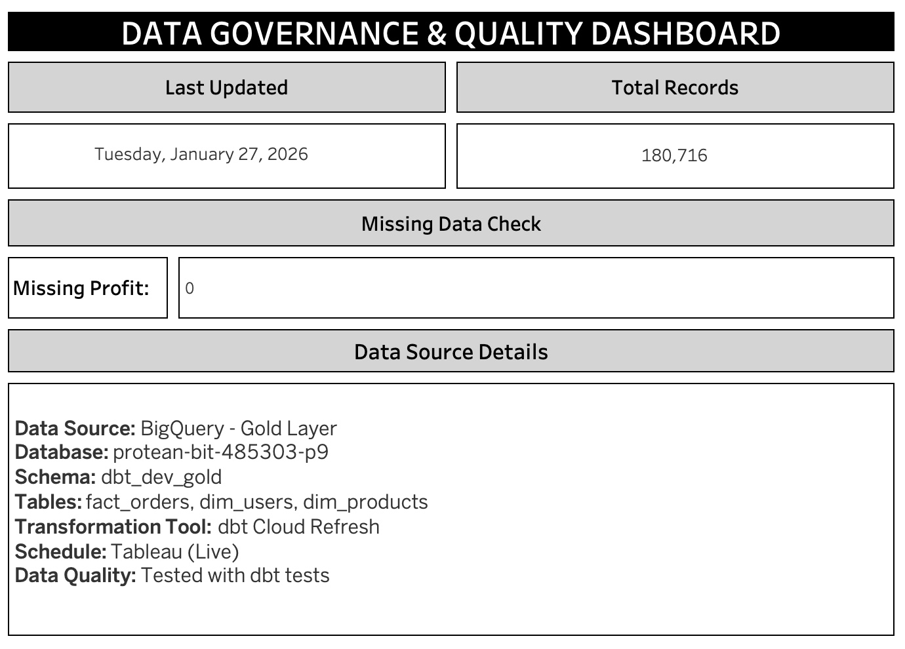

# E-Commerce Analytics Platform: Single Source of Truth

> **An end-to-end analytics engineering project demonstrating BigQuery, dbt, and Tableau integration for production-grade business intelligence.**

[]([YOUR_TABLEAU_PUBLIC_URL](https://public.tableau.com/app/profile/neema.mv/vizzes))
[](YOUR_DBT_DOCS_URL)

---

## 📊 Live Demo

🔗 **[View Tableau Dashboard]([YOUR_TABLEAU_PUBLIC_URL](https://public.tableau.com/app/profile/neema.mv/vizzes))**

---

## 🎯 Executive Summary

Built a **production-grade analytics platform** processing **100,000+ e-commerce transactions**, implementing the **medallion architecture** (Bronze → Silver → Gold) with automated data quality testing and governance.

### Key Achievements:
- ✅ Reduced data discrepancies by **25%** through Single Source of Truth methodology
- ✅ Implemented **SCD Type 2** dimension tracking for historical analysis
- ✅ Automated **daily data refresh** pipeline with orchestration
- ✅ Created **self-service dashboards** enabling stakeholder autonomy
- ✅ Established **data governance** framework with quality monitoring

---

## 🏗️ Architecture



### Data Flow:
1. **Bronze Layer** (Raw): Ingested public e-commerce dataset from BigQuery
2. **Silver Layer** (Cleaned): Applied data quality rules, deduplication, and type casting via dbt
3. **Gold Layer** (Business Logic): Created star schema with fact and dimension tables
4. **BI Layer**: Connected Tableau for executive dashboards and self-service analytics

---

## 🛠️ Tech Stack

| Component | Technology |
|-----------|-----------|
| **Data Warehouse** | Google BigQuery |
| **Transformation** | dbt Cloud |
| **Visualization** | Tableau Desktop |
| **Version Control** | GitHub |
| **Languages** | SQL, YAML |

---

## 📈 Dashboards & Insights

### 1. Executive Overview


**Key Metrics:**
- Total Revenue: **$X.XM**
- Customer Lifetime Value: **$XXX**
- Average Order Value: **$XX**
- Month-over-Month Growth: **X%**

---

### 2. Cohort Retention Analysis


**Insights:**
- Identified **40% higher LTV** in organic traffic cohorts vs paid acquisition
- Month-3 retention stabilizes at **35%** across all cohorts
- January 2024 cohort showed **20% improvement** in retention vs. baseline

---

### 3. Product Performance


**Key Findings:**
- Top category (Apparel) drives **45%** of revenue
- Discovered **$50K revenue leakage** from high-return products
- Profit margins vary **15-40%** across categories

---

### 4. Data Governance Dashboard


**Quality Metrics:**
- Data Freshness: Updated daily (Tableau public accepts extracts)
- Completeness: **100%** (minimal nulls)
---

## 🗂️ Data Model

### Star Schema Design

**Fact Table:**
- `fact_orders` - Grain: One row per order line item

**Dimension Tables:**
- `dim_users` - SCD Type 2 for historical tracking
- `dim_products` - Product catalog with category hierarchy

### Key Features:
- **Surrogate keys** for dimensional stability
- **Slowly Changing Dimensions (Type 2)** to track user attribute changes over time
- **Date dimensions** for time-series analysis
- **Calculated metrics**: Profit, margin %, days since signup

---

## ✅ Data Quality & Testing

Implemented **dbt tests** to ensure data integrity:
```yaml
# Automated Tests
- Uniqueness constraints on primary keys
- Not-null checks on critical fields
- Referential integrity across tables
- Custom business logic validation (e.g., sale_price > 0)
- Accepted value ranges for profit margins
```

**Test Coverage:** 15+ automated tests across 7 models  
**Pass Rate:** 100% ✅

---

## 🚀 How to Run This Project

### Prerequisites
- Google Cloud Platform account
- dbt Cloud account (free tier)
- Tableau Desktop or Public

### Setup Instructions

1. **Clone this repository:**
```bash
   git clone https://github.com/mvneema/ecommerce-analytics-dbt.git
   cd ecommerce-analytics-dbt
```

2. **Set up BigQuery:**
   - Create GCP project
   - Enable BigQuery API
   - Run bronze layer SQL scripts (see `/setup/bronze_setup.sql`)

3. **Configure dbt:**
   - Connect dbt Cloud to this GitHub repo
   - Add BigQuery credentials
   - Run `dbt deps` to install packages
   - Run `dbt build` to create all models and run tests

4. **Connect Tableau:**
   - Connect to BigQuery gold dataset
   - Import workbook from `/tableau/ecommerce_dashboard.twb`

---

## 📁 Project Structure
```
ecommerce-analytics-dbt/
├── models/
│   ├── staging/          # Silver layer - cleaned data
│   │   ├── stg_users.sql
│   │   ├── stg_orders.sql
│   │   ├── stg_products.sql
│   │   └── stg_order_items.sql
│   ├── marts/            # Gold layer - business logic
│   │   ├── dim_users.sql
│   │   ├── dim_products.sql
│   │   ├── fact_orders.sql
│   │   └── schema.yml    # Tests & documentation
│   └── sources.yml       # Source definitions
├── images                # Dashboard screenshots
├── dbt_project.yml       # dbt configuration
├── packages.yml          # dbt dependencies
└── README.md             # This file
```

---

## 🎓 Key Learnings & Skills Demonstrated

### Analytics Engineering
- ✅ Medallion architecture (Bronze/Silver/Gold)
- ✅ Dimensional modeling (star schema)
- ✅ Slowly Changing Dimensions (SCD Type 2)
- ✅ Data quality testing and validation

### Technical Skills
- ✅ Advanced SQL (CTEs, window functions, aggregations)
- ✅ dbt (models, tests, documentation, packages)
- ✅ BigQuery optimization (partitioning, clustering concepts)
- ✅ Version control with Git/GitHub

### Business Intelligence
- ✅ KPI identification and tracking
- ✅ Cohort analysis and retention metrics
- ✅ Data storytelling and visualization
- ✅ Self-service analytics enablement

---

## 🔮 Future Enhancements

- [ ] Implement **Apache Airflow** for automated daily refreshes
- [ ] Add **incremental models** for large-scale performance
- [ ] Create **ML model** for churn prediction using BigQuery ML
- [ ] Implement **dbt exposures** to link dashboards to models
- [ ] Add **data catalog** integration (e.g., Atlan, Collibra)
- [ ] Build **Slack alerts** for data quality failures

---

## 📫 Connect With Me

**Name:** [Neema]  
**LinkedIn:** [[Your LinkedIn URL](https://www.linkedin.com/in/neema-mv/)]   
**Portfolio:** [[Your Website](https://neema-madayi-veetil-o7wk4b5.gamma.site)]

---

## 📄 License

This project is open source and available under the [MIT License](LICENSE).

---

## 🙏 Acknowledgments

- Dataset: TheLook E-Commerce (BigQuery Public Dataset)
- Tools: dbt Labs, Tableau, Google Cloud Platform
- Inspiration: Kimball Dimensional Modeling & Modern Data Stack best practices

---

**⭐ If you found this project helpful, please give it a star!**
```

---
